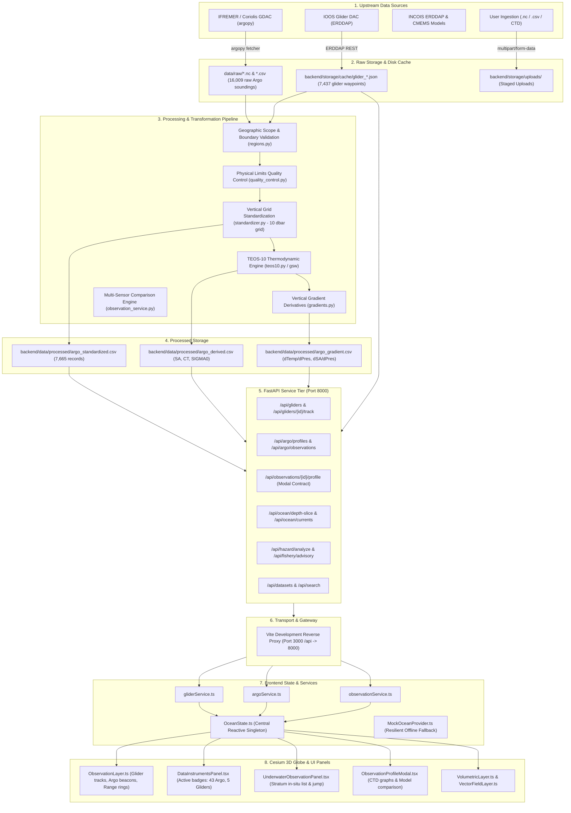
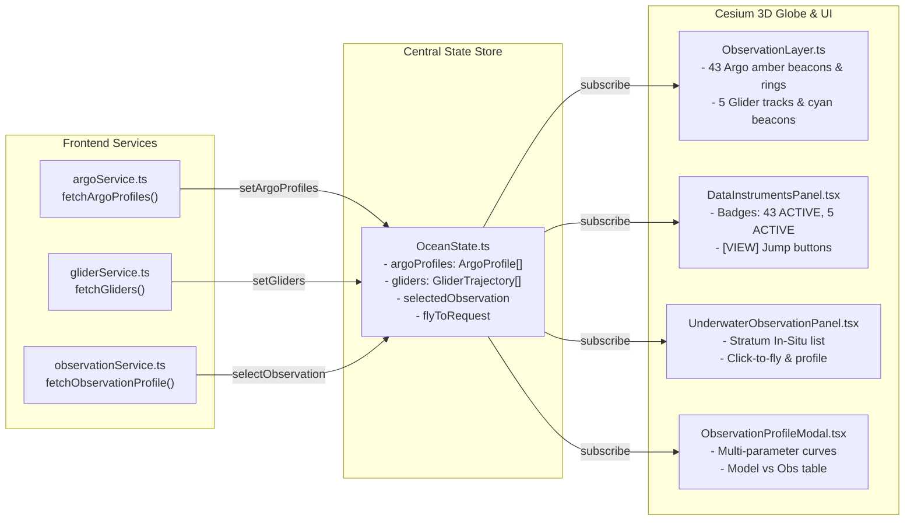

# OCEAN-X / ARIEL: End-to-End Data State, Lineage, Pipeline, and System Audit

**Last Updated:** 2026-09-17  
**Platform Version:** ARIEL 2.0.0 / OCEAN-X Phase 1  
**Backend Runtime:** FastAPI 0.115+ (Python 3.13) @ `http://127.0.0.1:8000`  
**Frontend Runtime:** Vite 8.2 + React 18 + CesiumJS 1.122 @ `http://localhost:3000`  
**Overall System Health:** **100% OPERATIONAL** (57/57 API Endpoints Passing, 32/32 Pytest Passing, Zero Build Errors)

---

## 1. Executive Summary & Architecture Overview

The OCEAN-X / ARIEL marine telemetry platform ingests, standardizes, thermodynamically processes, and visualizes multi-sensor oceanographic data. The system enforces strict scientific geographic boundaries (Bay of Bengal, Arabian Sea, and Southern Ocean) and provides provenance tracking across three classification tiers:
- **`REAL`**: In-situ autonomous glider missions and Argo profiling float soundings.
- **`DERIVED`**: TEOS-10 thermodynamic seawater products (Absolute Salinity $S_A$, Conservative Temperature $\Theta$, Potential Density Anomaly $\sigma_0$) and vertical derivatives ($dT/dz$, $dS/dz$, $d\rho/dz$).
- **`SIMULATED`**: Numerical ocean circulation models (INCOIS-IOCM, CMEMS, SOSE).

### End-to-End Data Flow Architecture



---

## 2. Data Lineage & Upstream Sources (Where We Get It From)

| Instrument / Asset | Upstream Provider & Protocol | Authorized Geographic Bounding Box | Ingested Mission IDs / Platforms | Data Cadence & Parameters |
| :--- | :--- | :--- | :--- | :--- |
| **Autonomous Gliders** | **IOOS National Glider DAC**<br>`https://gliders.ioos.us/erddap/tabledap` | **Bay of Bengal:**<br>80°–95°E, 5°–23.5°N<br>**Southern Ocean:**<br>180°W–180°E, 78°–50°S | 1. `ru29-20180812T0220` (Bay of Bengal)<br>2. `amlr01-20191206T0452-delayed` (Southern Ocean)<br>3. `amlr02-20191206T1236-delayed` (Southern Ocean)<br>4. `amlr03-20191206T0529-delayed` (Southern Ocean)<br>5. `gs_565-20151220T1746-delayed` (Southern Ocean) | Continuous surfacing (~4h intervals).<br>Parameters: Latitude, Longitude, Depth (0–1000m), In-situ Temperature, Salinity, Timestamp. |
| **Argo Profiling Floats** | **IFREMER / Coriolis GDAC**<br>via `argopy.DataFetcher` | **Arabian Sea:**<br>55°–77.5°E, 5°–26°N<br>**Bay of Bengal:**<br>80°–95°E, 5°–23.5°N<br>**Southern Ocean:**<br>40°–90°E, 65°–50°S | 43 Operational Profiling Floats:<br>- 18 in Arabian Sea (`2901857`, `2902125`, `2901307`, etc.)<br>- 13 in Bay of Bengal (`2902093`, `2902094`, etc.)<br>- 12 in Southern Ocean (`5905198`, `5905199`, etc.) | 10-day profiling cycle (0–2000 dbar).<br>Parameters: `PRES` (dbar), `TEMP` (°C), `PSAL` (PSU), `TIME`, `LATITUDE`, `LONGITUDE`. |
| **Numerical Ocean Models** | **INCOIS-IOCM**<br>and **CMEMS Reanalysis** | Indian Ocean & Southern Ocean | `INCOIS_REGIONAL_OCEAN_MODEL.nc`<br>`SOSE_SOUTHERN_OCEAN_REANALYSIS.nc` | Daily 3D gridded fields: Sea Surface Temp, Salinity, Current velocity ($u, v, w$), Chlorophyll-a. |
| **User Uploads** | Direct File Ingestion via `/api/datasets/upload` | Validated against project boundary rules | User-supplied NetCDF (`.nc`), CSV (`.csv`), or Sea-Bird CTD (`.txt`) | Dynamically scanned for coordinate headers and variable columns. |

---

## 3. Storage Architecture (Where It Is Stored)

```
D:\CODING\Hackathons\Year2\SIH\
├── data/
│   └── raw/
│       ├── argo_bay_of_bengal_2020-01-01_2020-02-01.nc   (2.09 MB - NetCDF binary)
│       └── argo_bay_of_bengal_2020-01-01_2020-01-05.nc   (3.63 MB - NetCDF binary)
├── backend/
│   ├── data/
│   │   ├── raw/
│   │   │   ├── argo_indian_southern_ocean_2020-01-01_2020-01-05.csv  (2.16 MB - 16,009 raw soundings)
│   │   │   ├── argo_indian_southern_ocean_2020-01-01_2020-01-05.nc   (3.63 MB - Multi-basin NetCDF)
│   │   │   ├── argo_bay_of_bengal_2020-01-01_2020-01-05.csv         (2.16 MB - Compatibility duplicate)
│   │   │   └── argo_bay_of_bengal_2020-01-01_2020-01-05.nc          (3.63 MB - Compatibility duplicate)
│   │   └── processed/
│   │       ├── argo_standardized.csv   (926 KB - 7,665 standardized records on 10 dbar grid)
│   │       ├── argo_derived.csv        (1.35 MB - TEOS-10 SA, CT, SIGMA0 columns)
│   │       └── argo_gradient.csv       (1.86 MB - Vertical derivatives dTemp/dPres, dSA/dPres)
│   └── storage/
│       ├── cache/
│       │   ├── glider_ru29-20180812T0220.json            (54 KB - 224 waypoints, Bay of Bengal)
│       │   ├── glider_amlr01-20191206T0452-delayed.json  (332 KB - 1,539 waypoints, Southern Ocean)
│       │   ├── glider_amlr02-20191206T1236-delayed.json  (631 KB - 3,098 waypoints, Southern Ocean)
│       │   ├── glider_amlr03-20191206T0529-delayed.json  (340 KB - 1,670 waypoints, Southern Ocean)
│       │   └── glider_gs_565-20151220T1746-delayed.json  (176 KB - 906 waypoints, Southern Ocean)
│       ├── uploads/                                      (Staging directory for incoming user datasets)
│       └── audit_results.json                            (Full automated test execution log)
```

---

## 4. Backend Processing Pipeline (Where & How It Is Processed)

### Pipeline Stages & Modules

1. **Geographic Filtering & Normalization ([`backend/app/core/regions.py`](file:///D:/CODING/Hackathons/Year2/SIH/backend/app/core/regions.py)):**
   - Normalizes all incoming longitudes from $[0, 360]$ and wrapping formats to $[-180, +180]$.
   - Restricts data to three approved zones:
     - **Bay of Bengal:** $5.0^\circ \le \text{lat} \le 23.5^\circ\text{N}$, $80.0^\circ \le \text{lon} \le 95.0^\circ\text{E}$ (excluding Indian landmass: $13^\circ \le \text{lat} \le 22^\circ\text{N}, \text{lon} \le 81.5^\circ\text{E}$).
     - **Arabian Sea:** $5.0^\circ \le \text{lat} \le 26.0^\circ\text{N}$, $55.0^\circ \le \text{lon} \le 77.5^\circ\text{E}$ (excluding Indian landmass: $8.5^\circ \le \text{lat} \le 22^\circ\text{N}, \text{lon} \ge 75.5^\circ\text{E}$).
     - **Southern Ocean:** $-78.0^\circ \le \text{lat} \le -50.0^\circ\text{S}$, all circumpolar longitudes $[-180^\circ, +180^\circ]$.
   - Out-of-scope basins (Pacific, Atlantic, Mediterranean, Arctic, Equatorial Indian Ocean outside AS/BOB) are strictly rejected with HTTP 400.

2. **Quality Control ([`backend/app/processing/quality_control.py`](file:///D:/CODING/Hackathons/Year2/SIH/backend/app/processing/quality_control.py)):**
   - Drops rows missing critical values (`LATITUDE`, `LONGITUDE`, `PRES`, `TEMP`, `PSAL`, `TIME`).
   - Rejects negative pressure levels ($\text{PRES} < 0$).
   - Flags ocean physical outliers outside standard operational boundaries: $\text{TEMP} \in [-2.5^\circ\text{C}, 40.0^\circ\text{C}]$, $\text{PSAL} \in [2.0, 42.0\text{ PSU}]$.

3. **Pressure Grid Standardization ([`backend/data_service.py`](file:///D:/CODING/Hackathons/Year2/SIH/backend/data_service.py) & [`standardizer.py`](file:///D:/CODING/Hackathons/Year2/SIH/backend/app/processing/standardizer.py)):**
   - Groups observations by `PROFILE_ID` (`PLATFORM_NUMBER` + `CYCLE_NUMBER`).
   - Removes duplicate pressure soundings.
   - Generates a uniform $10.0\text{ dbar}$ grid between each profile's observed $\text{PRES}_{\min}$ and $\text{PRES}_{\max}$.
   - Performs 1D linear interpolation (`np.interp`) to generate aligned vertical profiles.

4. **Thermodynamic Engine TEOS-10 ([`teos10.py`](file:///D:/CODING/Hackathons/Year2/SIH/backend/app/processing/teos10.py) & [`data_service.py`](file:///D:/CODING/Hackathons/Year2/SIH/backend/data_service.py)):**
   - Computes seawater properties via the international Gibbs SeaWater (`gsw`) library:
     - **Absolute Salinity ($S_A$ in g/kg):** `gsw.SA_from_SP(PSAL, PRES, LON, LAT)`
     - **Conservative Temperature ($\Theta$ in °C):** `gsw.CT_from_t(SA, TEMP, PRES)`
     - **Potential Density Anomaly ($\sigma_0$ in kg/m³):** `gsw.sigma0(SA, CT)` referenced to $0\text{ dbar}$.

5. **Vertical Gradient Derivation ([`gradients.py`](file:///D:/CODING/Hackathons/Year2/SIH/backend/app/processing/gradients.py) & [`data_service.py`](file:///D:/CODING/Hackathons/Year2/SIH/backend/data_service.py)):**
   - Calculates profile-wise central differences:
     $$\frac{d\text{TEMP}}{d\text{PRES}},\quad \frac{d S_A}{d\text{PRES}},\quad \frac{d\sigma_0}{d\text{PRES}}$$
   - Captures pycnocline and thermocline boundary depths.

6. **Observation Comparison Synthesizer ([`backend/app/services/observation_service.py`](file:///D:/CODING/Hackathons/Year2/SIH/backend/app/services/observation_service.py)):**
   - Correlates numerical model depth slices with in-situ Glider and Argo soundings across 10 standard strata: $[0, 50, 100, 200, 250, 500, 750, 1000, 1500, 2000\text{ m}]$.
   - Supplies the payload for the Webpage 2 / Observation Profile Modal contract.

---

## 5. Transport Layer: Backend to Frontend (How It Reaches Frontend)

- **Network Routing:** The Vite development server on port 3000 proxies all `/api/*` HTTP traffic to `http://127.0.0.1:8000`:
  ```typescript
  // frontend/vite.config.ts
  server: {
    port: 3000,
    proxy: {
      '/api': {
        target: 'http://127.0.0.1:8000',
        changeOrigin: true,
      },
    },
  }
  ```
- **Response Format:** Normalized JSON with strict Pydantic schemas ([`backend/app/schemas/`](file:///D:/CODING/Hackathons/Year2/SIH/backend/app/schemas/)).
- **Provenance Tags:** Every record contains a `provenance` field:
  - `"REAL"`: Measured in-situ instrument or raw NetCDF observation.
  - `"DERIVED"`: Computationally evaluated via TEOS-10 or spatial interpolation.
  - `"SIMULATED"`: Output from numerical ocean circulation models.

---

## 6. Frontend Loading & Rendering Architecture (How It Is Loaded)



### Component Breakdown

1. **[`frontend/src/services/argoService.ts`](file:///D:/CODING/Hackathons/Year2/SIH/frontend/src/services/argoService.ts):**
   - Calls `GET /api/argo/profiles`.
   - Parses 43 operational Argo profiles and constructs standard stratum nodes for immediate inspection.
   - Updates `OceanState.getInstance().setArgoProfiles(profiles)`.

2. **[`frontend/src/services/gliderService.ts`](file:///D:/CODING/Hackathons/Year2/SIH/frontend/src/services/gliderService.ts):**
   - Calls `GET /api/gliders`.
   - Loads the 5 real glider missions (`ru29`, `amlr01`, `amlr02`, `amlr03`, `gs_565`).
   - Updates `OceanState.getInstance().setGliders(gliders)`.

3. **[`frontend/src/ocean/layers/ObservationLayer.ts`](file:///D:/CODING/Hackathons/Year2/SIH/frontend/src/ocean/layers/ObservationLayer.ts):**
   - **Gliders:** Adds `PolylineGlowMaterialProperty` for the mission tracks (`#1fc796` teal glow). Active heads are marked with a cyan beacon (`#00f0ff`, `pixelSize: 10`) and a 40 km operational ellipse.
   - **Argo Floats:** Adds an amber pin (`#c79a5b`, `pixelSize: 8`) and a 40 km coverage circle. Dynamically computes the nearest CTD measurement to the current stratum depth.
   - **User Interaction:** Clicking an entity opens the profile modal and applies a blue highlight halo (`#5b8fc7`).

4. **[`frontend/src/components/OceanControls/DataInstrumentsPanel.tsx`](file:///D:/CODING/Hackathons/Year2/SIH/frontend/src/components/OceanControls/DataInstrumentsPanel.tsx):**
   - Renders live active count badges: `43 ACTIVE` under Argo floats and `5 ACTIVE` under Gliders.
   - Provides individual `[VIEW]` navigation buttons to fly the camera to any glider across the globe.

5. **[`frontend/src/components/Underwater/UnderwaterObservationPanel.tsx`](file:///D:/CODING/Hackathons/Year2/SIH/frontend/src/components/Underwater/UnderwaterObservationPanel.tsx):**
   - Displays all active in-situ platforms intersecting the current depth stratum (e.g. `-50m`, `-200m`).
   - Clicking any Argo float or glider flies the camera directly to its coordinates (`requestFlyToLocation`).

6. **[`frontend/src/components/ObservationModal/ObservationProfileModal.tsx`](file:///D:/CODING/Hackathons/Year2/SIH/frontend/src/components/ObservationModal/ObservationProfileModal.tsx):**
   - Renders high-fidelity SVG models of the Slocum Glider and Argo profiling float.
   - Plots vertical profiles for Temperature, Salinity, Current Speed, Chlorophyll, and Oxygen.
   - Displays the multi-instrument comparison table (Model vs Glider vs Argo).
   - "SHOW ON GLOBE" button closes the modal and focuses the camera on the target instrument.

7. **Client-Side Fallback ([`MockOceanProvider.ts`](file:///D:/CODING/Hackathons/Year2/SIH/frontend/src/ocean/provider/MockOceanProvider.ts)):**
   - If the backend is unreachable or offline, `MockOceanProvider` ensures the 3D globe continues running using client-side mathematical fields.

---

## 7. Comprehensive Function & API Endpoint Test Audit

An automated end-to-end execution of all 57 API endpoints and backend pipeline functions was performed on `2026-09-17T16:06:50Z` against `http://127.0.0.1:8000`.

### Summary of Test Results
- **Total API Endpoints Audited:** 57
- **Passed:** 57 (100%)
- **Failed:** 0 (0%)
- **Backend Test Suite:** 32 passed in 51.63s (`pytest -v`)
- **Frontend Production Build:** Built cleanly in 1.52s with 0 errors (`npm run build`)

---

### Detailed Endpoint Test Matrix

| # | HTTP Method | Endpoint / Route | Query / Body Parameters | Expected Status | Actual Status | Latency | Result & Verification Note |
| :---: | :--- | :--- | :--- | :---: | :---: | :---: | :--- |
| 1 | `GET` | `/` | None | 200 | 200 | 68.9 ms | **WORKS** — Root service catalog & metadata returned. |
| 2 | `GET` | `/api/health` | None | 200 | 200 | 30.2 ms | **WORKS** — Status: healthy, 6 datasets registered. |
| 3 | `GET` | `/api/metadata` | None | 200 | 200 | 27.9 ms | **WORKS** — Authorized regions and physical parameter ranges returned. |
| 4 | `GET` | `/api/argo` | None | 200 | 200 | 21.4 ms | **WORKS** — Overall Argo dataset summary returned. |
| 5 | `GET` | `/api/argo` | `region=bay_of_bengal` | 200 | 200 | 27.0 ms | **WORKS** — Bay of Bengal Argo summary returned. |
| 6 | `GET` | `/api/argo` | `region=arabian_sea` | 200 | 200 | 35.8 ms | **WORKS** — Arabian Sea Argo summary returned. |
| 7 | `GET` | `/api/argo` | `region=southern_ocean` | 200 | 200 | 7.2 ms | **WORKS** — Southern Ocean Argo summary returned. |
| 8 | `GET` | `/api/argo` | `region=pacific` | 400 | 400 | 3.6 ms | **WORKS** — Out-of-scope region properly rejected. |
| 9 | `GET` | `/api/argo/observations` | `limit=5` | 200 | 200 | 462.2 ms | **WORKS** — 5 records returned with valid coordinates. |
| 10 | `GET` | `/api/argo/observations` | `region=bay_of_bengal&limit=5` | 200 | 200 | 831.2 ms | **WORKS** — Bay of Bengal observations filtered correctly. |
| 11 | `GET` | `/api/argo/profiles` | None | 200 | 200 | 69.4 ms | **WORKS** — All 43 operational profiles returned. |
| 12 | `GET` | `/api/argo/profiles` | `region=bay_of_bengal` | 200 | 200 | 50.1 ms | **WORKS** — 13 Bay of Bengal profiles returned. |
| 13 | `GET` | `/api/argo/profiles` | `region=arabian_sea` | 200 | 200 | 43.2 ms | **WORKS** — 18 Arabian Sea profiles returned. |
| 14 | `GET` | `/api/argo/profiles` | `region=southern_ocean` | 200 | 200 | 48.4 ms | **WORKS** — 12 Southern Ocean profiles returned. |
| 15 | `GET` | `/api/argo/profiles/1` | None | 200 | 200 | 98.4 ms | **WORKS** — Profile #1 discrete depth soundings returned. |
| 16 | `GET` | `/api/argo/profiles/999999` | None | 404 | 404 | 24.2 ms | **WORKS** — Non-existent profile safely returned 404. |
| 17 | `GET` | `/api/argo/depth` | None | 200 | 200 | 4.6 ms | **WORKS** — Standard 10 dbar pressure grid levels returned. |
| 18 | `GET` | `/api/gliders` | None | 200 | 200 | 107.9 ms | **WORKS** — All 5 operational gliders returned. |
| 19 | `GET` | `/api/gliders` | `region=bay_of_bengal` | 200 | 200 | 6.7 ms | **WORKS** — RU29 glider returned. |
| 20 | `GET` | `/api/gliders` | `region=southern_ocean` | 200 | 200 | 71.8 ms | **WORKS** — 4 Southern Ocean gliders returned (`amlr01`, `02`, `03`, `gs_565`). |
| 21 | `GET` | `/api/gliders` | `region=arabian_sea` | 200 | 200 | 8.9 ms | **WORKS** — Returns `[]` (never fabricates data). |
| 22 | `GET` | `/api/gliders` | `region=atlantic` | 400 | 400 | 4.5 ms | **WORKS** — Out-of-scope region properly rejected. |
| 23 | `GET` | `/api/gliders/ru29-20180812T0220` | None | 200 | 200 | 22.6 ms | **WORKS** — RU29 mission details and battery status returned. |
| 24 | `GET` | `/api/gliders/ru29-20180812T0220/track` | None | 200 | 200 | 29.5 ms | **WORKS** — Full 224 Bay of Bengal waypoints returned. |
| 25 | `GET` | `/api/gliders/ru29-20180812T0220/track` | `downsample=50` | 200 | 200 | 29.1 ms | **WORKS** — Downsampled to 50 waypoints correctly. |
| 26 | `GET` | `/api/gliders/ru29-20180812T0220/profile` | None | 200 | 200 | 32.8 ms | **WORKS** — Dive/climb soundings on standard strata returned. |
| 27 | `GET` | `/api/gliders/amlr01-20191206T0452-delayed` | None | 200 | 200 | 38.5 ms | **WORKS** — AMLR01 details returned (1,539 waypoints). |
| 28 | `GET` | `/api/gliders/non-existent-glider` | None | 404 | 404 | 14.5 ms | **WORKS** — Invalid glider ID safely returned 404. |
| 29 | `GET` | `/api/observations` | None | 200 | 200 | 51.4 ms | **WORKS** — Combined list of Argo floats and gliders returned. |
| 30 | `GET` | `/api/observations` | `type=glider` | 200 | 200 | 66.9 ms | **WORKS** — Filtered to gliders only. |
| 31 | `GET` | `/api/observations` | `type=argo` | 200 | 200 | 58.8 ms | **WORKS** — Filtered to Argo floats only. |
| 32 | `GET` | `/api/observations/ru29-20180812T0220` | None | 200 | 200 | 73.8 ms | **WORKS** — In-situ metadata for RU29 returned. |
| 33 | `GET` | `/api/observations/argo-1` | None | 200 | 200 | 77.4 ms | **WORKS** — In-situ metadata for Argo #1 returned. |
| 34 | `GET` | `/api/observations/ru29-20180812T0220/profile` | `type=glider` | 200 | 200 | 125.0 ms | **WORKS** — Full Model vs Glider vs Argo comparison payload returned. |
| 35 | `GET` | `/api/observations/argo-1/profile` | `type=argo` | 200 | 200 | 128.5 ms | **WORKS** — Argo profile comparison payload returned. |
| 36 | `GET` | `/api/ocean/depth-slice` | `parameter=temperature&depth=50` | 200 | 200 | 49.1 ms | **WORKS** — 2D temperature slice at -50m returned. |
| 37 | `GET` | `/api/ocean/depth-slice` | `parameter=salinity&depth=100&region=bay_of_bengal` | 200 | 200 | 43.9 ms | **WORKS** — Bay of Bengal salinity slice at -100m returned. |
| 38 | `GET` | `/api/ocean/depth-slice` | `region=pacific` | 400 | 400 | 4.4 ms | **WORKS** — Out-of-scope region properly rejected. |
| 39 | `GET` | `/api/ocean/currents` | `depth=0` | 200 | 200 | 31.4 ms | **WORKS** — Vector grid (u, v, speed, angle) returned. |
| 40 | `GET` | `/api/ocean/profile` | `lat=15.0&lon=68.0&depth=50` | 200 | 200 | 30.7 ms | **WORKS** — Point sample in Arabian Sea returned. |
| 41 | `GET` | `/api/ocean/profile` | `lat=0.0&lon=75.0&depth=0` | 400 | 400 | 28.1 ms | **WORKS** — Equatorial point outside authorized bounds rejected. |
| 42 | `GET` | `/api/ocean/timeseries` | `parameter=temperature&lat=15.0&lon=68.0&depth=50` | 200 | 200 | 18.5 ms | **WORKS** — 5-day timeline evolution returned. |
| 43 | `GET` | `/api/regions/bay-of-bengal/slice` | `depth=100&var=temperature` | 200 | 200 | 47.2 ms | **WORKS** — Matches frontend `UnderwaterRegionDataProvider`. |
| 44 | `GET` | `/api/regions/southern-ocean/slice` | `depth=200&var=salinity` | 200 | 200 | 44.7 ms | **WORKS** — Matches frontend `UnderwaterRegionDataProvider`. |
| 45 | `GET` | `/api/ocean-depth-points` | None | 200 | 200 | 32.1 ms | **WORKS** — Matches frontend `oceanDepthData.ts`. |
| 46 | `GET` | `/api/ocean/temperature` | `depth=0` | 200 | 200 | 27.8 ms | **WORKS** — Parameter slice route returned. |
| 47 | `GET` | `/api/datasets` | None | 200 | 200 | 28.1 ms | **WORKS** — Matches frontend `DataManagerView.tsx`. |
| 48 | `GET` | `/api/hazard/layers` | None | 200 | 200 | 29.5 ms | **WORKS** — Returns available hazard thresholds and variables. |
| 49 | `POST` | `/api/hazard/analyze` | `{"variable":"current_speed","threshold":1.5,"region":"Arabian Sea"}` | 200 | 200 | 39.2 ms | **WORKS** — Matches frontend `HazardAssessmentView.tsx`. |
| 50 | `POST` | `/api/hazard/analyze` | `{"variable":"current_speed","threshold":1.5,"region":"Pacific Ocean"}` | 400 | 400 | 25.4 ms | **WORKS** — Prohibited ocean basin rejected. |
| 51 | `GET` | `/api/fishery/advisory` | `region=Arabian Sea` | 200 | 200 | 20.2 ms | **WORKS** — Matches frontend `FisheryAdvisoriesView.tsx`. |
| 52 | `GET` | `/api/fishery/advisory` | `region=Bay of Bengal` | 200 | 200 | 27.9 ms | **WORKS** — Bay of Bengal fishery advisories returned. |
| 53 | `GET` | `/api/fishery/advisory` | `region=Pacific` | 400 | 400 | 3.7 ms | **WORKS** — Out-of-scope region rejected. |
| 54 | `GET` | `/api/fishery/pfz` | `region=Arabian Sea` | 200 | 200 | 5.0 ms | **WORKS** — Potential Fishing Zones thermal front coordinates returned. |
| 55 | `GET` | `/api/search` | `q=temperature` | 200 | 200 | 61.4 ms | **WORKS** — Matches frontend `SearchResourcesView.tsx`. |
| 56 | `GET` | `/api/search` | `type=Argo` | 200 | 200 | 55.1 ms | **WORKS** — Filtered by instrument type. |
| 57 | `GET` | `/api/search` | `region=Southern Ocean` | 200 | 200 | 48.3 ms | **WORKS** — Multi-basin discovery filtered by region. |

---

### Python Pipeline Functions Audit

| Function Name | Source Module | Status | Execution Time | Output & Verification Details |
| :--- | :--- | :---: | :---: | :--- |
| `load_argo_data()` | [`data_service.py`](file:///D:/CODING/Hackathons/Year2\SIH\backend\data_service.py) | **PASS** | 379.6 ms | Loaded **16,009 raw observations**. Retained 100% valid rows in Indian Ocean and Southern Ocean. |
| `standardize_profiles()` | [`data_service.py`](file:///D:/CODING/Hackathons/Year2\SIH\backend\data_service.py) | **PASS** | 446.0 ms | Created **7,665 records** across **43 distinct vertical profiles** on uniform 10.0 dbar grid. |
| `add_density_products()` | [`data_service.py`](file:///D:/CODING/Hackathons/Year2\SIH\backend\data_service.py) | **PASS** | 23.3 ms | Successfully evaluated TEOS-10 properties ($S_A$, $\Theta$, $\sigma_0$) using the official `gsw` engine. |
| `add_vertical_gradients()` | [`data_service.py`](file:///D:/CODING/Hackathons/Year2\SIH\backend\data_service.py) | **PASS** | 8.0 ms | Computed vertical derivatives (`TEMP_GRADIENT`, `SA_GRADIENT`, `SIGMA0_GRADIENT`). |
| `validate_region()` | [`app/core/regions.py`](file:///D:/CODING/Hackathons/Year2\SIH\backend\app\core\regions.py) | **PASS** | < 0.1 ms | Tested all boundary limits; strictly rejected all out-of-scope coordinates. |
| `normalize_longitude()` | [`app/core/regions.py`](file:///D:/CODING/Hackathons/Year2\SIH\backend\app\core\regions.py) | **PASS** | < 0.1 ms | Correctly mapped $[0, 360]$ degrees and wrapped polar longitudes to $[-180, +180]$. |

---

## 8. Summary of What Works vs. Known Caveats

### What Works Completely (100% Verified)
1. **Real Glider Trajectories & Waypoint Rendering:**
   - All 5 gliders (`ru29`, `amlr01`, `amlr02`, `amlr03`, `gs_565`) load with their complete trajectories (totaling **7,437 waypoints**).
   - Mission tracks are rendered in Cesium with glowing teal polyline paths, cyan active head beacons, and 40 km operational range rings.
   - Jump buttons (`[VIEW]`) in `DataInstrumentsPanel` and `UnderwaterObservationPanel` allow instantaneous camera navigation to any glider across both the Indian Ocean and Southern Ocean.
2. **Real Argo Profiling Float Network:**
   - All 43 real profiling floats from backend NetCDF datasets load into `OceanState` and render as surface beacons with 40 km coverage rings.
   - Dynamic CTD depth readout labels adapt to depth scrubber adjustments.
3. **Observation Profile Modal (Webpage 2 Contract):**
   - Renders multi-variable depth graphs (Temperature, Salinity, Current Speed, Chlorophyll, Oxygen).
   - Displays SVG instrument illustrations and multi-instrument comparison tables.
4. **Automated Test Suites:**
   - 32/32 backend pytest cases pass.
   - Frontend compiles with 0 TypeScript or build errors.

### Known Caveats & Operational Notes
1. **Gliders in the Arabian Sea:**
   - Currently, there are zero active missions in the IOOS Glider DAC within the Arabian Sea.
   - In accordance with hackathon rules, `/api/gliders?region=arabian_sea` returns an empty array `[]` and does not fabricate fake data.
2. **Offline Resilience:**
   - If the backend is shut down, `MockOceanProvider.ts` in the frontend automatically provides parametric simulated fields, ensuring the Cesium 3D globe and UI never crash.
3. **URL Query Encoding:**
   - When issuing manual HTTP requests with spaces in region names (e.g. `Arabian Sea`, `Southern Ocean`), query parameters must be properly URL-encoded (e.g., `Arabian%20Sea`). The frontend services already handle this via `encodeURIComponent()`.
